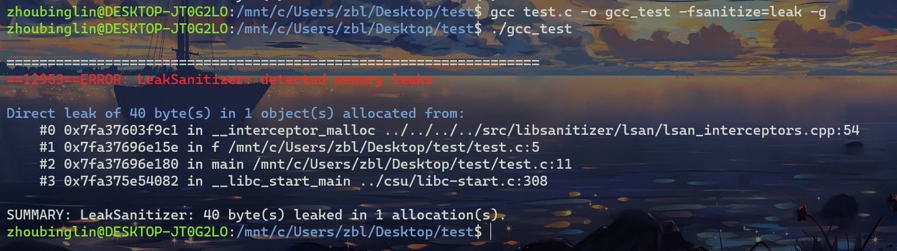

# How to Detect Memory Leak
## why memory leak?
申请的动态空间没有释放，即
* `new` 没有对应的 `delete`
* `malloc` 没有对应的 `free`
## How to detect?
### 一. Valgrind
#### 1.查看有没有装Valgrind：
```bash
valgrind
```
或
```
valgrind --version
```
若已安装valgrind应显示


或


#### 2.安装Valgrind:
```bash
sudo apt install valgrind
```
另外还可以通过下载源码编译安装

源码地址：https://valgrind.org/

下载源码：
```bash
wget https://sourceware.org/pub/valgrind/valgrind-3.20.0.tar.bz2
```
解压并安装：
```bash
tar -jxvf valgrind-3.20.0.tar.bz2
cd valgrind-3.20.0
./configure
make
sudo make install
```
安装后可以再次按照上面的步骤检查是否成功安装了valgrind
#### 3.开始使用
假设现在有一份有 memory leak 的代码如下：
```cpp
#include <stdlib.h>

void f(void)
{
 int* x = malloc(10 * sizeof(int));
}

int main(void)
{
 f();
 return 0;
}
```
我们即可编译代码并使用valgrind检测：
```bash
gcc -g test.c -o valgrind_test
valgrind --leak-check=yes ./valgrind_test
```
关于更多valgrind的使用方法，可以参考官方文档：https://valgrind.org/docs/manual/index.html
### 二. 使用 gcc 或 g++ 的 -fsanitize=leak 编译选项
g++ `-fsanitize` 编译选项其实已经提供了很多内存检测的功能，包括内存泄漏检测、内存访问越界检测等等，这些功能都是在编译时开启的。
常用的三个 `-fsanitize` 编译选项如下:
* `-fsanitize=address`：内存访问越界检测
* `-fsanitize=undefined`：未定义行为检测
* `-fsanitize=leak`：内存泄漏检测
有时我们需要更加详细的信息（比如：定位到错误在源代码中的位置）可以再加上 `-g` 选项。

对于同样的例子，我们使用 `-fsanitize=leak` 编译选项进行检测：
```bash
gcc test.c -o gcc_test -fsanitize=leak -g
./gcc_test
```
若检测出错误则会，显示如下信息：
